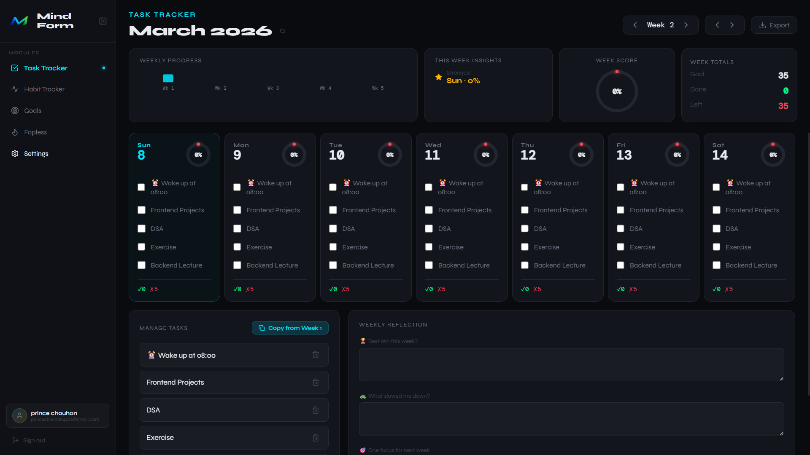
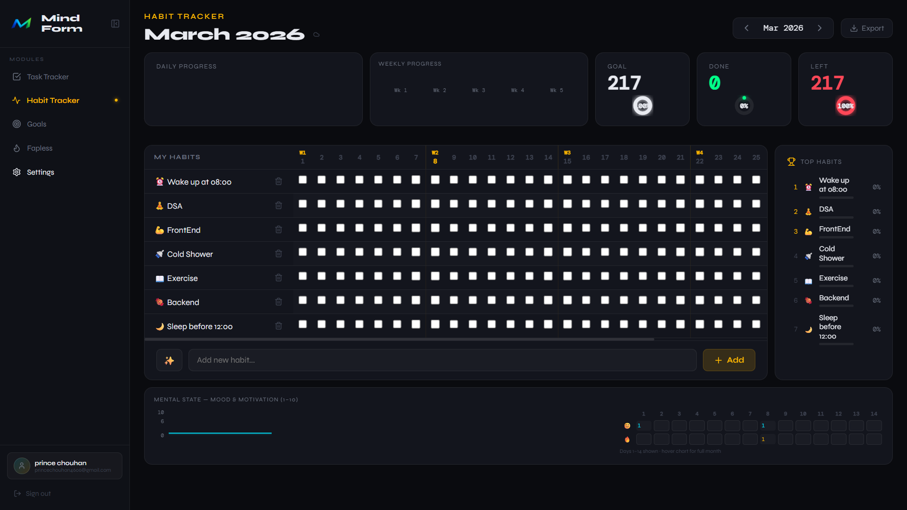
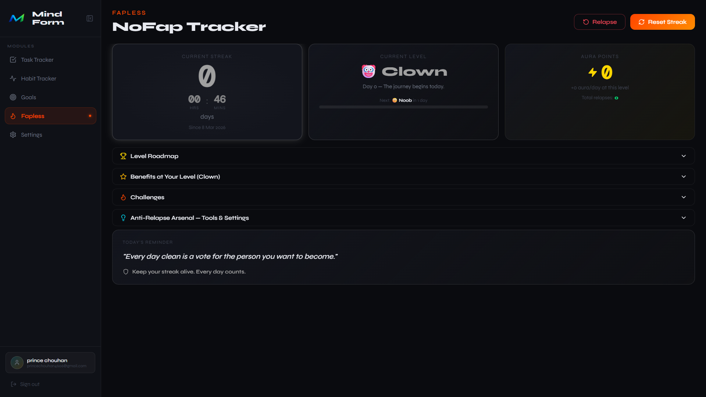
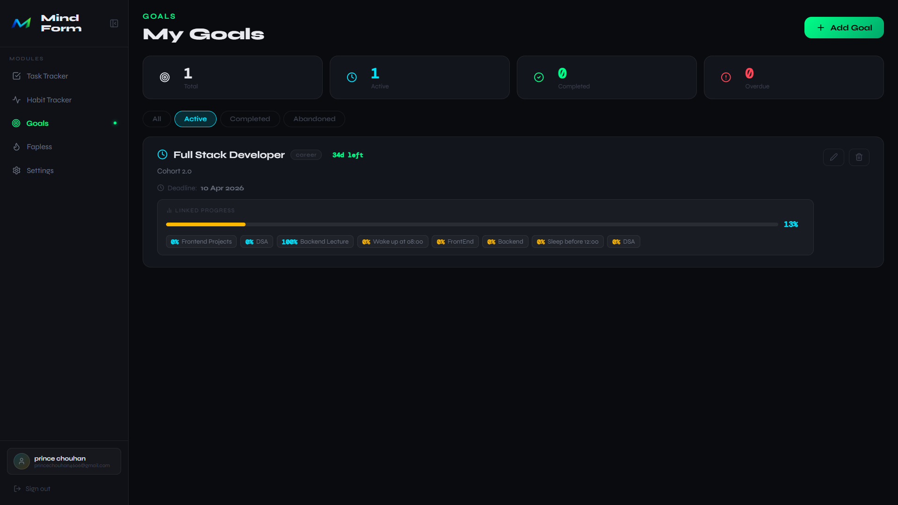
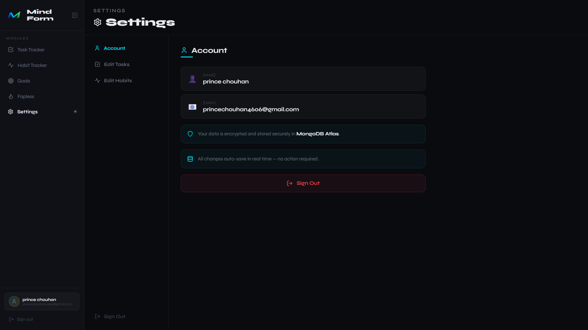

<p align="center">
  
</p>

# 🌌 Mindform Dashboard

<p align="center">
  <a href="https://mindform.onrender.com/"><strong>🚀 Live Demo</strong></a>
</p>

**Mindform** is a high-performance, full-stack productivity ecosystem designed to streamline personal growth through data-driven habit tracking, task management, and psychological wellness monitoring.

Built with a modern **PERN-style** architecture (replacing PG with MongoDB), Mindform offers a seamless, real-time synchronized experience for high-achievers.

---

### 🤝 Social Hub (Crowdsourced Growth)
- **Live Leaderboard:** Real-time ranking of top public profiles by streak days and Aura points.
- **Community Forum:** Private group discussion board with **2-day auto-delete history** for privacy and focus.
- **Social Profiles:** Customizable public/private profiles with country flags, bios, and follower/following stats.
- **Admin Engine:** Robust badge assignment system (🎥 Content Creator, 👑 OG Member, 🔱 Sigma) for verified community figures.

### 🍱 Fapless Aura System
- **Real-time Aura Gain:** Dynamic +1 Aura/second tracking with pulsating UI feedback for active streaks.
- **Premium Dashboard:** High-fidelity "Power Module" design with glassmorphism, animated level titles, and identity cards.
- **Psychological Anchoring:** Level-based identity shifts (e.g., "Novice" → "Monk" → "Legend") to reinforce behavioral change.

### 🛡️ Anti-Abuse & Security Layer
- **Disposable Mail Blocking:** Integrated blocklist of 200+ temporary/spam email providers (Mailinator, Yopmail, etc.).
- **Bot Defense:** Silent honeypots and IP-based rate limiting (max 3 registrations/hour) to keep the community genuine.
- **Data Privacy:** Automated 24-hour cleanup of AI Chat history and 48-hour cleanup of forum messages.

### 🎯 Goal Management
- **Structured Progress:** Create and track multi-category goals (Career, Health, Spirit) with deadlines and visual progress bars.
- **Habit Integration:** Correlation between daily habit completion and high-level goal advancement.

### 🤖 AI Intelligence
- **Dual Engine:** Seamlessly toggle between **Google Gemini 1.5 Flash** and **Mistral AI** within a unified chat interface.
- **Markdown Context:** Optimized response rendering for technical and planning advice.

---

## 📸 Showcase

| Task Tracker | Habit Tracker |
|:---:|:---:|
|  |  |
| **NoFap / Social Dashboard** | **Goals & Settings** |
|  |  |
| **Social Hub / Leaderboard** | **AI Chat Interface** |
|  |  |

---

## 🛠️ Technology Stack

| Layer | Technologies |
| :--- | :--- |
| **Frontend** | React 18, Vite, Recharts, Lucide Icons, Vanilla CSS (Premium) |
| **Backend** | Node.js, Express, JWT, Helmet.js, Rate-Limiting |
| **Database** | MongoDB Atlas (NoSQL) |
| **Deployment** | Render (CI/CD Integrated) |

---

## 📁 System Architecture

```text
mindform/
├── backend/          # RESTful API Engine
│   ├── src/
│   │   ├── models/   # Data Schemas (User, Task, Habit, Fapless)
│   │   ├── routes/   # Express Router Implementation
│   │   └── middleware/# JWT Verification & Security Layer
├── frontend/         # High-Fidelity UI
│   ├── src/
│   │   ├── api/      # Modular API Client
│   │   ├── context/  # Global Auth & Session Management
│   │   └── views/    # Responsive View Components
```

---

## ⚡ Technical Setup

### Backend
1. `cd backend`
2. `npm install`
3. Configure `.env` (refer to `.env.example` for `MONGO_URI` and `JWT_SECRET`)
4. `npm start` (Runs on port 5000)

### Frontend
1. `cd frontend`
2. `npm install`
3. `npm run dev` (Runs on port 5173)

---

## 🔒 Security & Performance
- **Data Isolation:** All database queries are scoped by User ID for strict tenancy isolation.
- **Sanitization:** Implements Helmet.js and CORS protection for high-integrity production environments.
- **Optimized Builds:** Vite-powered bundling for lightning-fast asset delivery on mobile and desktop.

---

© 2026 Mindform. All Rights Reserved.
